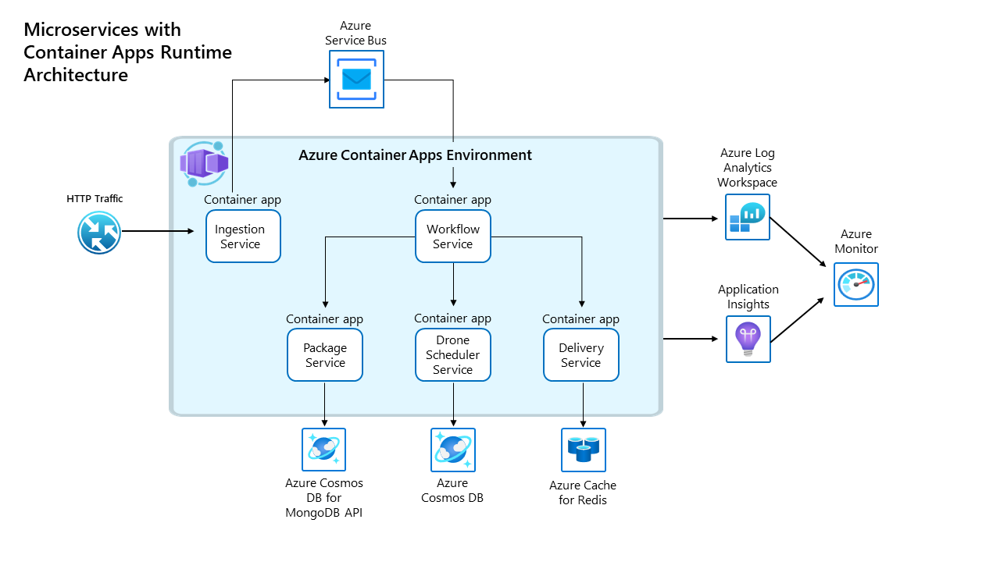

# Azure Container Apps example scenario

This repo contains the implementation that backs the [Deploy microservices with Azure Container Apps](https://learn.microsoft.com/azure/architecture/example-scenario/serverless/microservices-with-container-apps) article in the Azure Architecture Center. It's encouraged that you read through that guidance before proceeding here as it gives you an overview of the scenario and architecture; this repo is its deployment guide.

## Introduction

Fabrikam Inc has an existing (brownfield) application called Drone Delivery. This application has been running for a while in Azure Kubernetes Service (AKS), and while they are obtaining the benefits of containers to run microservices and Kubernetes to host them, it has been discovered that they are not making use of any of the advanced features of AKS.

The team has detected an opportunity to simplify and be more efficient at the DevOps level, and this is why they are now looking into Azure Container Apps to evaluate hosting Fabrikam Drone Delivery. This will allow them to publish and run containerized microservices at scale, faster than before, reducing the complexity, saving resources by using scale-to-zero, built-in autoscaling capability, and without losing all the container advantages they love.

Azure Container Apps is a managed environment that enables you to run microservices and containerized applications on a serverless platform. Technically speaking, it's an app-centric abstraction on top of AKS, with native features such as KEDA and Dapr integrated.

## Migrating a microservices workload from AKS to Azure Container Apps

This repository guides you through the process of running a single workload composed of multiple microservices in Azure Container Apps. In this example scenario, the Fabrikam Drone Delivery app that was previously running in Azure Kubernetes Services will be run in a newly created Azure Container App environment. This application platform is optimized for running applications that span multiple microservices. This example makes some containers internet-facing via an HTTPS ingress, and internally accessible thanks to its built-in DNS-based service discovery capability. Additionally, it will manage their secrets in a secure manner and authenticate against Azure Key Vault resources using managed identities.



### Core features

For more information on how the Container Apps features are being used in this reference implementation, please take a look below:

- [HTTPS ingress, exposing the Ingestion service to the internet.](https://learn.microsoft.com/azure/container-apps/ingress-overview)
- [Internal service discovery, Delivery, DroneScheduler and Package services must be internally reachable by Workflow service](https://learn.microsoft.com/azure/container-apps/connect-apps)
- [Use user-assigned identities when authenticating into Azure KeyVault from Delivery and DroneScheduler services](https://learn.microsoft.com/azure/container-apps/managed-identity#add-a-user-assigned-identity)
- [Securely manage secrets for Package, Ingestion and Workflow services](https://learn.microsoft.com/azure/container-apps/manage-secrets)
- [Run containers from any registry, the Fabrikam Drone Delivery uses Azure Container Registry (ACR) to publish its Docker images](https://learn.microsoft.com/azure/container-apps/containers)
- [Use Revisions in Azure Container Apps to safely deploy updates, where appropriate](https://learn.microsoft.com/azure/container-apps/revisions). ❗ Workflow Service is a message consumer app, so it is deployed in single revision mode, otherwise an old version could still process a message if it happens to be the one that retrieves it first.
- [Use ARM templates to deploy my application, there is no need for another layer of indirection like Helm charts. All the Drone Delivery containers are part of the ARM templates](https://learn.microsoft.com/azure/container-apps/get-started)
- [Logs, see the container logs directly in Log Analytics without configuring any provider from code or Azure service](https://learn.microsoft.com/azure/container-apps/logging).

## Expected results

Following the steps below will result in the creation of the following Azure resources that will be used throughout this example scenario.

| Object                                 | Purpose                                                 |
| :------------------------------------- | :------------------------------------------------------ |
| An Azure Container App Environment     | This is the managed Container App environment where Container Apps are deployed |
| Five Azure Container Apps              | These are the Azure resources that represent the five Fabrikam microservices in the Azure Container App environment |
| An Azure Container Registry            | This is the private container registry where all Fabrikam workload images are uploaded and later pulled from the different Azure Container Apps |
| An Azure Log Analytics Workspace       | This is where all the Container Apps logs are sent, along with Azure Diagnostics on all services |
| An Azure Application Insights instance | All services are sending trace information to a shared Azure Application Insights instance |
| Three Azure Cosmos DB instances        | Delivery, Drone Scheduler, and Package services each have a Cosmos DB account |
| An Azure Managed Redis instance        | Delivery service uses Azure Managed Redis to keep track of inflight deliveries |
| An Azure Service Bus                   | Ingestion and Workflow services communicate using Azure Service Bus queues |
| Five Azure User Managed Identities     | These are going to give `Read` and `List` secrets permissions over Azure Key Vault to the microservices. |
| Five Azure Key Vault instances         | Each microservice (Delivery, Drone Scheduler, Workflow, Ingestion, Package) has its own Key Vault for secrets |

## Deployment guide

### Prerequisites

- An Azure subscription.

  You can [open an account for free](https://azure.microsoft.com/pricing/purchase-options/azure-account?cid=msft_learn).

  - The subscription must have all of the resource providers used in this deployment [registered](https://learn.microsoft.com/azure/azure-resource-manager/management/resource-providers-and-types#azure-cli).

    - `Microsoft.App`
    - `Microsoft.Cache`
    - `Microsoft.ContainerRegistry`
    - `Microsoft.DocumentDB`
    - `Microsoft.Insights`
    - `Microsoft.KeyVault`
    - `Microsoft.ManagedIdentity`
    - `Microsoft.OperationalInsights`
    - `Microsoft.ServiceBus`

  - The subscription must have the following quota and SKU availability in the region you choose.

    - Azure Application Insights: 1 instance
    - Azure Container Apps: 1 zone-redundant environment, 5 container apps (3 replicas each)
    - Azure Container Registry: 1 Premium tier instance with geo-replication
    - Azure Cosmos DB: 3 accounts (2 Azure Cosmos DB for NoSQL, 1 Azure Cosmos DB for MongoDB)
    - Azure Key Vault: 5 Standard tier instances
    - Azure Log Analytics: 1 workspace
    - Azure Managed Redis: 1 Balanced B0 instance
    - Azure Service Bus: 1 Premium namespace

- Your deployment user must have the ability to assign Azure roles on newly created resource groups and resources. (E.g. `User Access Administrator` or `Owner`)

- Latest version of [Azure CLI installed](https://learn.microsoft.com/cli/azure/install-azure-cli?view=azure-cli-latest) or you can perform this from Azure Cloud Shell by clicking below.

  [](https://shell.azure.com)

  > :bulb: If you're executing this from Windows Subsystem for Linux (WSL), be sure the Azure CLI is installed in WSL and is not using the version installed in Windows. `which az` must show `/usr/bin/az`.

### Steps

1. Clone this repository.

   ```bash
   git clone https://github.com/mspnp/container-apps-fabrikam-dronedelivery.git
   ```

   :bulb: The steps shown here and elsewhere in the reference implementation use Bash shell commands. On Windows, you can [install Windows Subsystem for Linux](https://learn.microsoft.com/windows/wsl/install#install).

1. Navigate to the container-apps-fabrikam-dronedelivery folder

   ```bash
   cd ./container-apps-fabrikam-dronedelivery
   ```

1. Log into Azure from the CLI.

   ```bash
   az login
   ```

1. Ensure required Azure CLI extensions are installed.

   The only extension used by this deployment guide is the Application Insights extension.

   ```bash
   az extension add -n application-insights
   az extension add -n redisenterprise
   ```

1. Set environment variables.

   ```bash
   LOCATION=eastus2
   RESOURCE_GROUP=rg-shipping-dronedelivery-${LOCATION}
   ```

   :bulb: The region must support availability zones. See [Azure regions with availability zones](https://learn.microsoft.com/azure/reliability/availability-zones-service-support#azure-regions-with-availability-zone-support).

1. Create a resource group for your deployment.

   ```bash
   az group create -n $RESOURCE_GROUP -l $LOCATION
   ```

1. Deploy all the dependencies of the various microservices that comprise the workload.

   > None of these resources are for the application platform hosting the workload, but instead are tied directly to the drone delivery workload. For example, the per-microservice Key Vault, the per-microservice data stores, the message queue, logging sinks, etc. These same resources would exist no matter if the application platform was Azure Container Apps, Kubernetes, or App Service.

   :clock7: *This might take about 30 minutes.*

   ```bash
   az deployment group create -n workload-dependencies -g $RESOURCE_GROUP -f ./workload/workload-stamp.bicep
   ```

1. Build, tag, and host the five microservice container images in Azure Container Registry (ACR).

   You'll be using your container registry to build and then host the containers.

   :clock8: *This might take about 15 minutes.*

   ```bash
   ACR_NAME=$(az deployment group show -g $RESOURCE_GROUP -n workload-dependencies --query properties.outputs.acrName.value -o tsv)
   ACR_SERVER=$(az acr show -n $ACR_NAME --query loginServer -o tsv)

   az acr build -r $ACR_NAME -t $ACR_SERVER/shipping/delivery:0.1.0 ./workload/src/shipping/delivery/.
   az acr build -r $ACR_NAME -t $ACR_SERVER/shipping/ingestion:0.1.0 ./workload/src/shipping/ingestion/.
   az acr build -r $ACR_NAME -t $ACR_SERVER/shipping/workflow:0.1.0 ./workload/src/shipping/workflow/.
   az acr build -r $ACR_NAME -f ./workload/src/shipping/dronescheduler/Dockerfile -t $ACR_SERVER/shipping/dronescheduler:0.1.0 ./workload/src/shipping/.
   az acr build -r $ACR_NAME -t $ACR_SERVER/shipping/package:0.1.0 ./workload/src/shipping/package/.
   ```

1. Get the microservices configuration details from the workload resource deployment.

   ```bash
   AI_NAME=$(az deployment group show -g $RESOURCE_GROUP -n workload-dependencies --query properties.outputs.appInsightsName.value -o tsv)
   AI_KEY=$(az monitor app-insights component show -g $RESOURCE_GROUP -a $AI_NAME --query instrumentationKey -o tsv)
   APPINSIGHTS_CONNECTION_STRING=$(az monitor app-insights component show -g $RESOURCE_GROUP -a $AI_NAME --query connectionString --output tsv)
   AI_ID=$(az monitor app-insights component show -g $RESOURCE_GROUP -a $AI_NAME --query appId -o tsv)
   ACR_ID=$(az deployment group show -g $RESOURCE_GROUP -n workload-dependencies --query properties.outputs.acrId.value -o tsv)
   LA_WORKSPACE_ID=$(az deployment group show -g $RESOURCE_GROUP -n workload-dependencies --query properties.outputs.laWorkspace.value -o tsv)

   echo -e "\nCommon Config:\nAI_NAME=${AI_NAME}\nAI_KEY=${AI_KEY}\nAI_ID=${AI_ID}\nACR_ID=${ACR_ID}\nLA_WORKSPACE_ID=${LA_WORKSPACE_ID}\n"

   # Delivery
   DELIVERY_COSMOSDB_NAME=$(az deployment group show -g $RESOURCE_GROUP -n workload-dependencies --query properties.outputs.deliveryCosmosDbName.value -o tsv)
   DELIVERY_DATABASE_NAME="${DELIVERY_COSMOSDB_NAME}-db"
   DELIVERY_COLLECTION_NAME="${DELIVERY_COSMOSDB_NAME}-col"
   DELIVERY_COSMOSDB_ENDPOINT=$(az cosmosdb show -g $RESOURCE_GROUP -n $DELIVERY_COSMOSDB_NAME --query documentEndpoint -o tsv)
   DELIVERY_REDIS_NAME=$(az deployment group show -g $RESOURCE_GROUP -n workload-dependencies --query properties.outputs.deliveryRedisName.value -o tsv)
   DELIVERY_REDIS_ENDPOINT=$(az redisenterprise show -g $RESOURCE_GROUP -n $DELIVERY_REDIS_NAME --query hostName -o tsv)
   DELIVERY_KEYVAULT_URI=$(az deployment group show -g $RESOURCE_GROUP -n workload-dependencies --query properties.outputs.deliveryKeyVaultUri.value -o tsv)

   echo -e "\nDelivery Config:\nDELIVERY_COSMOSDB_NAME=${DELIVERY_COSMOSDB_NAME}\nDELIVERY_DATABASE_NAME=${DELIVERY_DATABASE_NAME}\nDELIVERY_COLLECTION_NAME=${DELIVERY_COLLECTION_NAME}\nDELIVERY_COSMOSDB_ENDPOINT=${DELIVERY_COSMOSDB_ENDPOINT}\nDELIVERY_REDIS_NAME=${DELIVERY_REDIS_NAME}\nDELIVERY_REDIS_ENDPOINT=${DELIVERY_REDIS_ENDPOINT}\nDELIVERY_KEYVAULT_URI=${DELIVERY_KEYVAULT_URI}\n"

   # Drone scheduler
   DRONESCHEDULER_COSMOSDB_NAME=$(az deployment group show -g $RESOURCE_GROUP -n workload-dependencies --query properties.outputs.droneSchedulerCosmosDbName.value -o tsv)
   DRONESCHEDULER_COSMOSDB_ENDPOINT=$(az cosmosdb show -g $RESOURCE_GROUP -n $DRONESCHEDULER_COSMOSDB_NAME --query documentEndpoint -o tsv)
   DRONESCHEDULER_KEYVAULT_URI=$(az deployment group show -g $RESOURCE_GROUP -n workload-dependencies --query properties.outputs.droneSchedulerKeyVaultUri.value -o tsv)

   echo -e "\nScheduler Config:\nDRONESCHEDULER_COSMOSDB_NAME=${DRONESCHEDULER_COSMOSDB_NAME}\nDRONESCHEDULER_COSMOSDB_ENDPOINT=${DRONESCHEDULER_COSMOSDB_ENDPOINT}\nDRONESCHEDULER_KEYVAULT_URI=${DRONESCHEDULER_KEYVAULT_URI}\n"

   # Workflow
   WORKFLOW_NAMESPACE_NAME=$(az deployment group show -g $RESOURCE_GROUP -n workload-dependencies --query properties.outputs.ingestionQueueNamespace.value -o tsv)
   WORKFLOW_NAMESPACE_ENDPOINT=$(az servicebus namespace show -g $RESOURCE_GROUP -n $WORKFLOW_NAMESPACE_NAME --query serviceBusEndpoint -o tsv)
   WORKFLOW_NAMESPACE_SAS_NAME=$(az deployment group show -g $RESOURCE_GROUP -n workload-dependencies --query properties.outputs.workflowServiceAccessKeyName.value -o tsv)
   WORKFLOW_NAMESPACE_SAS_KEY=$(az servicebus namespace authorization-rule keys list -g $RESOURCE_GROUP --namespace-name $WORKFLOW_NAMESPACE_NAME -n $WORKFLOW_NAMESPACE_SAS_NAME --query primaryKey -o tsv)
   WORKFLOW_QUEUE_NAME=$(az deployment group show -g $RESOURCE_GROUP -n workload-dependencies --query properties.outputs.ingestionQueueName.value -o tsv)

   echo -e "\nWorkflow Config:\nWORKFLOW_NAMESPACE_NAME=${WORKFLOW_NAMESPACE_NAME}\nWORKFLOW_NAMESPACE_ENDPOINT=${WORKFLOW_NAMESPACE_ENDPOINT}\nWORKFLOW_NAMESPACE_SAS_NAME=${WORKFLOW_NAMESPACE_SAS_NAME}\nWORKFLOW_NAMESPACE_SAS_KEY=${WORKFLOW_NAMESPACE_SAS_KEY}\nWORKFLOW_QUEUE_NAME=${WORKFLOW_QUEUE_NAME}\n"

   # Package
   PACKAGE_MONGODB_NAME=$(az deployment group show -g $RESOURCE_GROUP -n workload-dependencies --query properties.outputs.packageMongoDbName.value -o tsv)
   PACKAGE_MONGODB_CONNECTIONSTRING=$(az cosmosdb keys list --type connection-strings -g $RESOURCE_GROUP --name $PACKAGE_MONGODB_NAME --query "connectionStrings[0].connectionString" -o tsv | sed 's/==/%3D%3D/g')

   echo -e "\nPackage Config:\nPACKAGE_MONGODB_NAME=${PACKAGE_MONGODB_NAME}\nPACKAGE_MONGODB_CONNECTIONSTRING=${PACKAGE_MONGODB_CONNECTIONSTRING}\n"

   # Ingestion
   INGESTION_NAMESPACE_NAME=$(az deployment group show -g $RESOURCE_GROUP -n workload-dependencies --query properties.outputs.ingestionQueueNamespace.value -o tsv)
   INGESTION_NAMESPACE_SAS_NAME=$(az deployment group show -g $RESOURCE_GROUP -n workload-dependencies --query properties.outputs.ingestionServiceAccessKeyName.value -o tsv)
   INGESTION_NAMESPACE_SAS_KEY=$(az servicebus namespace authorization-rule keys list -g $RESOURCE_GROUP --namespace-name $INGESTION_NAMESPACE_NAME -n $INGESTION_NAMESPACE_SAS_NAME --query primaryKey -o tsv)
   INGESTION_QUEUE_NAME=$(az deployment group show -g $RESOURCE_GROUP -n workload-dependencies --query properties.outputs.ingestionQueueName.value -o tsv)

   echo -e "\nIngestion Config:\nINGESTION_NAMESPACE_NAME=${INGESTION_NAMESPACE_NAME}\nINGESTION_NAMESPACE_SAS_NAME=${INGESTION_NAMESPACE_SAS_NAME}\nINGESTION_NAMESPACE_SAS_KEY=${INGESTION_NAMESPACE_SAS_KEY}\nINGESTION_QUEUE_NAME=${INGESTION_QUEUE_NAME}"
   ```

   If any of the configuration values above are empty, stop and troubleshoot before proceeding.

1. Deploy the Azure Container Apps environment and each microservice.

   :clock9: *This might take about four minutes.*

   ```bash
   az deployment group create -f main.bicep -g $RESOURCE_GROUP -p \
      logAnalyticsResourceId="${LA_WORKSPACE_ID}" \
      applicationInsightsInstrumentationKey="${AI_KEY}" \
      applicationInsightsConnectionString="${APPINSIGHTS_CONNECTION_STRING}" \
      containerRegistryResourceId="${ACR_ID}" \
      deliveryCosmosdbDatabaseName="${DELIVERY_DATABASE_NAME}" \
      deliveryCosmosdbCollectionName="${DELIVERY_COLLECTION_NAME}" \
      deliveryCosmosdbEndpoint="${DELIVERY_COSMOSDB_ENDPOINT}" \
      deliveryRedisEndpoint="${DELIVERY_REDIS_ENDPOINT}" \
      deliveryKeyVaultUri="${DELIVERY_KEYVAULT_URI}" \
      droneSchedulerCosmosdbEndpoint="${DRONESCHEDULER_COSMOSDB_ENDPOINT}" \
      droneSchedulerKeyVaultUri="${DRONESCHEDULER_KEYVAULT_URI}" \
      workflowNamespaceEndpoint="${WORKFLOW_NAMESPACE_ENDPOINT}" \
      workflowNamespaceSASName="${WORKFLOW_NAMESPACE_SAS_NAME}" \
      workflowNamespaceSASKey="${WORKFLOW_NAMESPACE_SAS_KEY}" \
      workflowQueueName="${WORKFLOW_QUEUE_NAME}" \
      packageMongodbConnectionString="${PACKAGE_MONGODB_CONNECTIONSTRING}" \
      ingestionNamespaceName="${INGESTION_NAMESPACE_NAME}" \
      ingestionNamespaceSASName="${INGESTION_NAMESPACE_SAS_NAME}" \
      ingestionNamespaceSASKey="${INGESTION_NAMESPACE_SAS_KEY}" \
      ingestionQueueName="${INGESTION_QUEUE_NAME}"
   ```

   > :book: Deployment approach: Bicep vs. imperative control in CD pipelines
   >
   > In this reference implementation, the deployment of the applications to the environment is performed using Bicep modules for simplicity and reproducibility. In production environments, it is recommended to deploy application containers as part of your continuous delivery (CD) pipeline using the appropriate automation tools. This enables easier incremental roll outs, such as traffic shifting over time.
   >
   > - For GitHub Workflows, see: [Deploy to Azure Container Apps with GitHub Actions](https://learn.microsoft.com/azure/container-apps/github-actions)
   > - For Azure Pipelines, see: [Deploy to Azure Container Apps from Azure Pipelines](https://learn.microsoft.com/azure/container-apps/azure-pipelines)

## Try it out

Now that you have deployed your Container Apps Environment and the five microservices to it, you can validate its functionality. This section will help you to validate the workload is exposed through a Container Apps HTTP ingress flow and responding to HTTP requests correctly.

1. Get the Ingestion service's FQDN

    > :book: The app team conducts a final acceptance test to ensure that traffic is flowing end-to-end as expected. To do so, an HTTP request is submitted against the ingestion external ingress.

   ```bash
   INGESTION_FQDN=$(az deployment group show -g $RESOURCE_GROUP -n main --query properties.outputs.ingestionFqdn.value -o tsv)
   echo $INGESTION_FQDN
   ```

1. Create a delivery request using your microservices hosted on ACA.

   > This calls the only Internet-exposed service in the cluster. This kicks off the five microservices to handle the request.

   ```bash
   curl -X POST "https://${INGESTION_FQDN}/api/deliveryrequests" --header 'Content-Type: application/json' --header 'Accept: application/json' -d '{
      "confirmationRequired": "None",
      "deadline": "",
      "dropOffLocation": "drop off",
      "expedited": true,
      "ownerId": "myowner",
      "packageInfo": {
        "packageId": "mypackage",
        "size": "Small",
        "tag": "mytag",
        "weight": 10
      },
      "pickupLocation": "mypickup",
      "pickupTime": "'$(date -u +%FT%TZ)'"
    }' | json_pp
   ```

   The response in your terminal should look similar to the one shown below:

   ```json
   {
      "confirmationRequired" : "None",
      "deadline" : "",
      "deliveryId" : "00001111-aaaa-2222-bbbb-3333cccc4444",
      "dropOffLocation" : "drop off",
      "expedited" : true,
      "ownerId" : "myowner",
      "packageInfo" : {
         "packageId" : "mypackage",
         "size" : "Small",
         "tag" : "mytag",
         "weight" : 10
      },
      "pickupLocation" : "mypickup",
      "pickupTime" : "2026-05-14T20:10:00.000+0000"
   }
   ```

1. Query Application Insights to ensure your request has been ingested by the underlying services.

   :stopwatch: *It might take ten minutes for the full query results to be available.*

   ```bash
   az monitor app-insights query --app $AI_ID --analytics-query 'requests
   | summarize count_=sum(itemCount) by operation_Name
   | order by operation_Name
   | project strcat(operation_Name," (", count_, ")")' --query tables[0].rows[] -o table
   ```

   The following output demonstrates the type of response to expect from the Application Insights query.

   ```text
   Result
   --------------------------------------------------
   PUT DroneDeliveries/Put [id] (1)
   PUT Deliveries/Put [id] (1)
   PUT /api/packages/mypackage (1)
   POST /api/deliveryrequests (1)
   GET /api/packages/mypackage (1)
   GET /healthz (120)
   GET /api/probe (44)
   ```

   :book: The above result demonstrates that the HTTP request, initiated from the client, was ingested by `/api/deliveryrequests`, then consumed by the Workflow background service and dispatched to the `Deliveries/Put`, `/api/packages/mypackage`, and `DroneDeliveries/Put` endpoints respectively.

## :broom: Clean up

1. Delete the resource group that contains all the resources.

   | :warning: | This will completely delete all resources in this resource group. |
   | :-------: | :------------------------- |

   :clock6: *This might take about 10 minutes.*

   ```bash
   az group delete -n $RESOURCE_GROUP -y
   ```

1. Purge deleted Key Vaults related to this deployment.

   ```bash
   az keyvault list-deleted --query [].name -o tsv

   # Per Key Vault that was related to this deployment (should be five of them)
   az keyvault purge -n <name>
   ```

## Next steps

The team has been able to migrate and run Fabrikam Drone Delivery in Azure Container Apps. They are now laying out a new modernization plan that will include:

- [Start using DAPR](https://learn.microsoft.com/azure/container-apps/microservices#dapr-integration)
- [Bring your own virtual network](https://learn.microsoft.com/azure/container-apps/vnet-custom)
- Addressing [production readiness changes](#production-readiness-changes)

## Production readiness changes

The infrastructure as code included in this repository has a few configurations that are made only to enable a smoother and less expensive deployment experience when you are first trying this implementation out. These settings are not recommended for production deployments, and you should evaluate each of the settings before deploying to production. Those settings all have a comment next to them that starts with `Production readiness change:`.

## Contributions

Please see our [contributor guide](./CONTRIBUTING.md).

This project has adopted the [Microsoft Open Source Code of Conduct](https://opensource.microsoft.com/codeofconduct/). For more information see the [Code of Conduct FAQ](https://opensource.microsoft.com/codeofconduct/faq/) or contact <opencode@microsoft.com> with any additional questions or comments.
