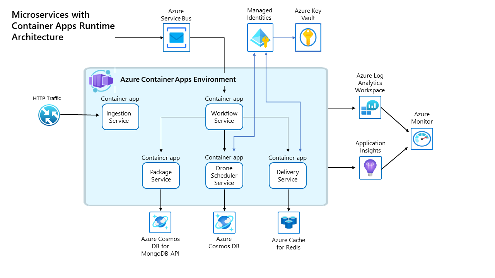

# Azure Container Apps example scenario

This repo contains the implementation that backs the [Deploy microservices with Azure Container Apps](https://learn.microsoft.com/azure/architecture/example-scenario/serverless/microservices-with-container-apps) article in the Azure architecture center. It's encouraged that you read through that guidance before proceeding here as it gives you an overview of the scenario and architecture; this repo is its deployment guide.

## Introduction

Fabrikam inc has created a new operations team, and under its organization is a brownfield application called [Drone Delivery](https://github.com/mspnp/fabrikam-dronedelivery-workload/tree/beb2c60f9450ce04038fb95aa0110ab4143fc76a). This application been running for a while in [Azure Kubernetes Service (AKS)](https://github.com/mspnp/microservices-reference-implementation), and while they are obtaining the benefits of containers to run microservices and Kubernetes to host them, it has been discovered that they are not making use of any of the advance features of AKS like custom service mesh or autoscaling among others.

The team has detected an opportunity to simplify and be more efficient at the devops level, and this is why they are now looking into Azure Container Apps to evaluate hosting Fabrikam Drone Delivery. This will allow them to publish and run containarized microservices at scale, faster than before, reducing the complexity, saving resources by using scale-to-zero, built-in autoscaling capability, and without losing all the container advantages they love.

Azure Container Apps is a fully managed environment that enables you to run microservices and containerized applications on a serverless platform. Technically speaking, it's an app-centric abstraction on top of AKS, with native features such as KEDA and Dapr integrated.

## Migrating a microservices workload from AKS to Azure Container Apps

This repository guides you through the process of running an single workload composed of multiple microservices in Azure Container Apps. In this example scenario, the Fabrikam Drone Delivery app that was previously running in Azure Kubernetes Services will be run in a newly created Azure Container App environment. This application platform is optimized for running applications that span multiple microservices. This example will make some containers internet-facing via an HTTPS ingress, and internally accessible thanks to its built-in DNS-based service discovery capability. Additionally, it will manage their secrets in a secure manner and authenticate against Azure Key Vault resources using managed identities.




### Core features

For more information on how the Container Apps features are being used in this reference implementation, please take a look below:

- [HTTPS ingress, this allows to expose the Ingestion service to internet.](https://learn.microsoft.com/azure/container-apps/ingress-overview)
- [Internal service discovery, Delivery, DroneScheduler and Package services must be internally reachable by Workflow service](https://learn.microsoft.com/azure/container-apps/connect-apps)
- [Use user-assigned identities when authenticating into Azure KeyVault from Delivery and DroneScheduler services](https://learn.microsoft.com/azure/container-apps/managed-identity#add-a-user-assigned-identity)
- [Securely manage secrets for Package, Ingestion and Workflow services](https://learn.microsoft.com/azure/container-apps/manage-secrets)
- [Run containers from any registry, the Fabrikam Drone Delivery uses Azure Container Registry (ACR) to publish its Docker images](https://learn.microsoft.com/azure/container-apps/containers)
- [Use Revisions in Azure Container Apps to safely deploy updates, where appropriate](https://learn.microsoft.com/azure/container-apps/revisions). ❗ Workflow Service is a message consumer app, so it needs to be deployed in single revision mode, otherwise an old versions could still process a message if it happens to be the one that retrieves it first.
- [Use ARM templates to deploy my application, there is no need for another layer of indirection like Helm charts. All the Drone Delivery containers are part of the ARM templates](https://learn.microsoft.com/azure/container-apps/get-started)
- [Logs, see the container logs directly in Log Analytics without configuring any provider from code or Azure service](https://learn.microsoft.com/azure/container-apps/logging).

## Expected results

Following the steps below will result in the creation of the following Azure resources that will be used throughout this example scenario.

| Object                                 | Purpose                                                 |
| :------------------------------------- | :------------------------------------------------------ |
| An Azure Container App Environment     | This is the managed Container App environment where Container Apps are deployed |
| Five Azure Container Apps              | These are the Azure resources that represents the five Fabrikam microservices in the Azure Container App environment |
| An Azure Container Registry            | This is the private container registry where all Fabrikam workload images are uploaded and later pulled from the different Azure Container Apps |
| An Azure Log Analytics Workspace       | This is where all the Container Apps logs are sent, along with Azure Diagnostics on all services |
| An Azure Application Insights instance | All services are sending trace information to a shared Azure Application Insights instance |
| Two Azure Cosmos DB instances          | Delivery and Package services have dependencies on Azure Cosmos DB |
| An Azure Redis Cache instance          | Delivery service uses Azure Redis cache to keep track of inflight deliveries |
| An Azure Service Bus                   | Ingestion and Workflow services communicate using Azure Service Bus queues |
| Five Azure User Managed Identities     | These are going to give `Read` and `List` secrets permissions over Azure Key Vault to the microservices. |
| Five Azure Key Vault instances         | Secrets are saved into Azure Key Vault instances. :warning: Currently only two out of five instances are being used as part of this reference implementation |

## Deployment guide

### Prerequisites

- An Azure subscription in which you have at least Contributor access to. You can [open an account for free](https://azure.microsoft.com/free).
- Latest version of [Azure CLI installed](https://learn.microsoft.com/cli/azure/install-azure-cli?view=azure-cli-latest) or you can perform this from Azure Cloud Shell by clicking below.

  [](https://shell.azure.com)   

- The required [resource providers registered](https://learn.microsoft.com/azure/azure-resource-manager/management/resource-providers-and-types#azure-cli).
   - `Microsoft.App`
   - `Microsoft.Cache`
   - `Microsoft.DocumentDB`
   - `Microsoft.KeyVault`
   - `Microsoft.ServiceBus`
### Steps

1. Clone this repository.

   ```bash
   git clone --recurse-submodules https://github.com/mspnp/container-apps-fabrikam-dronedelivery.git
   ```

   :bulb: The steps shown here and elsewhere in the reference implementation use Bash shell commands. On Windows, you can [install Windows Subsystem for Linux](https://learn.microsoft.com/windows/wsl/install#install) to run Bash by entering the following command in PowerShell or Windows Command Prompt and then restarting your machine: `wsl --install`

1. Navigate to the container-apps-fabrikam-dronedelivery folder

   ```bash
   cd ./container-apps-fabrikam-dronedelivery
   ```

1. Log into Azure from the CLI.

   ```bash
   az login
   ```

1. Deploy the workload's user managed identities.

   > This deploys two resource groups (rg-shipping-dronedelivery and rg-shipping-dronedelivery-acr) and one managed identity per microservice, to later be assigned to roles on various services.

   ```bash
   # [This takes about one minute.]
   az deployment sub create --name workload-stamp-prereqs --location eastus --template-file ./workload/workload-stamp-prereqs.json -p resourceGroupLocation=eastus

   DELIVERY_PRINCIPAL_ID=$(az identity show -g rg-shipping-dronedelivery -n uid-delivery --query principalId -o tsv) && \
   DRONESCHEDULER_PRINCIPAL_ID=$(az identity show -g rg-shipping-dronedelivery -n uid-dronescheduler --query principalId -o tsv) && \
   WORKFLOW_PRINCIPAL_ID=$(az identity show -g rg-shipping-dronedelivery -n uid-workflow --query principalId -o tsv) && \
   PACKAGE_PRINCIPAL_ID=$(az identity show -g rg-shipping-dronedelivery -n uid-package --query principalId -o tsv) && \
   INGESTION_PRINCIPAL_ID=$(az identity show -g rg-shipping-dronedelivery -n uid-ingestion --query principalId -o tsv)
   ```

   > **Warning**
   > Please note that only the Delivery and DroneScheduler services are making actual use of the manage identities to access their Azure Key Vault instances.

1. Deploy the workload's resources.

   > This deploys all of the dependencies of the various microservices in the workload. None of these resources are for the application platform, but instead are tied directly to the drone delivery workload. For example, the per-microservice Key Vault, the per-microservice data stores, the message queue. These same resources would exist no matter what the container application platform was.

   ```bash
   # [This takes about 18 minutes.]
   az deployment group create -f ./workload/workload-stamp.json -g rg-shipping-dronedelivery -p droneSchedulerPrincipalId=$DRONESCHEDULER_PRINCIPAL_ID \
   -p workflowPrincipalId=$WORKFLOW_PRINCIPAL_ID \
   -p deliveryPrincipalId=$DELIVERY_PRINCIPAL_ID \
   -p ingestionPrincipalId=$INGESTION_PRINCIPAL_ID \
   -p packagePrincipalId=$PACKAGE_PRINCIPAL_ID
   ```

1. Obtain the Azure Container Registry (ACR) details.

   ```bash
   ACR_NAME=$(az deployment group show -g rg-shipping-dronedelivery -n workload-stamp --query properties.outputs.acrName.value -o tsv)
   ACR_SERVER=$(az acr show -n $ACR_NAME --query loginServer -o tsv)
   ```

1. Build, tag, and host the five microservice container images in ACR.

   ```bash
   # [This takes about 10 minutes.]
   az acr build -r $ACR_NAME -t $ACR_SERVER/shipping/delivery:0.1.0 ./workload/src/shipping/delivery/.
   az acr build -r $ACR_NAME -t $ACR_SERVER/shipping/ingestion:0.1.0 ./workload/src/shipping/ingestion/.
   az acr build -r $ACR_NAME -t $ACR_SERVER/shipping/workflow:0.1.0 ./workload/src/shipping/workflow/.
   az acr build -r $ACR_NAME -f ./workload/src/shipping/dronescheduler/Dockerfile -t $ACR_SERVER/shipping/dronescheduler:0.1.0 ./workload/src/shipping/.
   az acr build -r $ACR_NAME -t $ACR_SERVER/shipping/package:0.1.0 ./workload/src/shipping/package/.
   ```

1. Get the Application Insights instrumentation key.

   ```bash
   AI_NAME=$(az deployment group show -g rg-shipping-dronedelivery -n workload-stamp --query properties.outputs.appInsightsName.value -o tsv)
   AI_KEY=$(az resource show -g rg-shipping-dronedelivery -n $AI_NAME --resource-type "Microsoft.Insights/components" --query properties.InstrumentationKey -o tsv)
   AI_ID=$(az resource show -g rg-shipping-dronedelivery -n $AI_NAME --resource-type "Microsoft.Insights/components" --query properties.AppId -o tsv)
   ```

1. Get microservices configuration details

   ```bash
   # Delivery
   DELIVERY_COSMOSDB_NAME=$(az deployment group show -g rg-shipping-dronedelivery -n workload-stamp --query properties.outputs.deliveryCosmosDbName.value -o tsv)
   DELIVERY_DATABASE_NAME="${DELIVERY_COSMOSDB_NAME}-db"
   DELIVERY_COLLECTION_NAME="${DELIVERY_COSMOSDB_NAME}-col"
   DELIVERY_COSMOSDB_ENDPOINT=$(az cosmosdb show -g rg-shipping-dronedelivery -n $DELIVERY_COSMOSDB_NAME --query documentEndpoint -o tsv)
   DELIVERY_REDIS_NAME=$(az deployment group show -g rg-shipping-dronedelivery -n workload-stamp --query properties.outputs.deliveryRedisName.value -o tsv)
   DELIVERY_REDIS_ENDPOINT=$(az redis show -g rg-shipping-dronedelivery -n $DELIVERY_REDIS_NAME --query hostName -o tsv)
   DELIVERY_KEYVAULT_URI=$(az deployment group show -g rg-shipping-dronedelivery -n workload-stamp --query properties.outputs.deliveryKeyVaultUri.value -o tsv)

   # Drone scheduler
   DRONESCHEDULER_COSMOSDB_NAME=$(az deployment group show -g rg-shipping-dronedelivery -n workload-stamp --query properties.outputs.droneSchedulerCosmosDbName.value -o tsv)
   DRONESCHEDULER_COSMOSDB_ENDPOINT=$(az cosmosdb show -g rg-shipping-dronedelivery -n $DRONESCHEDULER_COSMOSDB_NAME --query documentEndpoint -o tsv)
   DRONESCHEDULER_KEYVAULT_URI=$(az deployment group show -g rg-shipping-dronedelivery -n workload-stamp --query properties.outputs.droneSchedulerKeyVaultUri.value -o tsv)

   # Workflow
   WORKFLOW_NAMESPACE_NAME=$(az deployment group show -g rg-shipping-dronedelivery -n workload-stamp --query properties.outputs.ingestionQueueNamespace.value -o tsv)
   WORKFLOW_NAMESPACE_ENDPOINT=$(az servicebus namespace show -g rg-shipping-dronedelivery -n $WORKFLOW_NAMESPACE_NAME --query serviceBusEndpoint -o tsv)
   WORKFLOW_NAMESPACE_SAS_NAME=$(az deployment group show -g rg-shipping-dronedelivery -n workload-stamp --query properties.outputs.workflowServiceAccessKeyName.value -o tsv)
   WORKFLOW_NAMESPACE_SAS_KEY=$(az servicebus namespace authorization-rule keys list -g rg-shipping-dronedelivery --namespace-name $WORKFLOW_NAMESPACE_NAME -n $WORKFLOW_NAMESPACE_SAS_NAME --query primaryKey -o tsv)
   WORKFLOW_QUEUE_NAME=$(az deployment group show -g rg-shipping-dronedelivery -n workload-stamp --query properties.outputs.ingestionQueueName.value -o tsv)

   # Package
   PACKAGE_MONGODB_NAME=$(az deployment group show -g rg-shipping-dronedelivery -n workload-stamp --query properties.outputs.packageMongoDbName.value -o tsv)
   PACKAGE_MONGODB_CONNNECTIONSTRING=$(az cosmosdb keys list --type connection-strings -g rg-shipping-dronedelivery --name $PACKAGE_MONGODB_NAME --query "connectionStrings[0].connectionString" -o tsv | sed 's/==/%3D%3D/g')

   # Ingestion
   INGESTION_NAMESPACE_NAME=$(az deployment group show -g rg-shipping-dronedelivery -n workload-stamp --query properties.outputs.ingestionQueueNamespace.value -o tsv)
   INGESTION_NAMESPACE_SAS_NAME=$(az deployment group show -g rg-shipping-dronedelivery -n workload-stamp --query properties.outputs.ingestionServiceAccessKeyName.value -o tsv)
   INGESTION_NAMESPACE_SAS_KEY=$(az servicebus namespace authorization-rule keys list -g rg-shipping-dronedelivery --namespace-name $INGESTION_NAMESPACE_NAME -n $INGESTION_NAMESPACE_SAS_NAME --query primaryKey -o tsv)
   INGESTION_QUEUE_NAME=$(az deployment group show -g rg-shipping-dronedelivery -n workload-stamp --query properties.outputs.ingestionQueueName.value -o tsv)
   ```

1. Enable Azure Container Registry's admin access.

   > For this brownfield workload deployment, the Azure Container Registry instance uses legacy admin user access. While this ideally would be an AcrPull RBAC assignment, for this deployment, consider this technical debt and not guidance. Also making imparative changes like this outside of your IaC is never encouraged.

   ```bash
   # [This takes about one minute.]
   az acr update -n $ACR_NAME --admin-enabled true
   ACR_PASS=$(az acr credential show -n $ACR_NAME --query "passwords[0].value" -o tsv)
   ```

1. Deploy the Container Apps ARM template

   ```bash
   # [This takes about eight minutes.]
   az deployment group create -f main.bicep -g rg-shipping-dronedelivery -p \
      acrSever=$ACR_SERVER \
      containerRegistryUser=$ACR_NAME \
      containerRegistryPassword=$ACR_PASS \
      applicationInsightsInstrumentationKey=$AI_KEY \
      deliveryCosmosdbDatabaseName=$DELIVERY_DATABASE_NAME \
      deliveryCosmosdbCollectionName=$DELIVERY_COLLECTION_NAME \
      deliveryCosmosdbEndpoint=$DELIVERY_COSMOSDB_ENDPOINT \
      deliveryRedisEndpoint=$DELIVERY_REDIS_ENDPOINT \
      deliveryKeyVaultUri=$DELIVERY_KEYVAULT_URI \
      droneSchedulerCosmosdbEndpoint=$DRONESCHEDULER_COSMOSDB_ENDPOINT \
      droneSchedulerKeyVaultUri=$DRONESCHEDULER_KEYVAULT_URI \
      wokflowNamespaceEndpoint=$WORKFLOW_NAMESPACE_ENDPOINT \
      workflowNamespaceSASName=$WORKFLOW_NAMESPACE_SAS_NAME \
      workflowNamespaceSASKey=$WORKFLOW_NAMESPACE_SAS_KEY \
      workflowQueueName=$WORKFLOW_QUEUE_NAME \
      packageMongodbConnectionString=$PACKAGE_MONGODB_CONNNECTIONSTRING \
      ingestionNamespaceName=$INGESTION_NAMESPACE_NAME \
      ingestionNamespaceSASName=$INGESTION_NAMESPACE_SAS_NAME \
      ingestionNamespaceSASKey=$INGESTION_NAMESPACE_SAS_KEY \
      ingestionQueueName=$INGESTION_QUEUE_NAME
   ```

## Try it out

Now that you have deployed your Container Apps Environment, you can validate its functionality. This section will help you to validate the workload is exposed through a Container Apps HTTP ingress flow and responding to HTTP requests correctly.

### Steps

1. Get the Ingestion FQDN

    > :book: The app team conducts a final acceptance test to ensure that traffic is flowing end-to-end as expected. To do so, an HTTP request is submitted against the ingestion external ingress.

   ```bash
   INGESTION_FQDN=$(az deployment group show -g rg-shipping-dronedelivery -n main --query properties.outputs.ingestionFqdn.value -o tsv)
   ```

1. Send a request to https://dronedelivery.fabrikam.com.

   > :bulb: Since the certificate used for TLS is self-signed, the request disables TLS validation using the '-k' option.

   ```bash
   curl -X POST "https://${INGESTION_FQDN}/api/deliveryrequests" --header 'Content-Type: application/json' --header 'Accept: application/json' -d '{
      "confirmationRequired": "None",
      "deadline": "",
      "dropOffLocation": "drop off",
      "expedited": true,
      "ownerId": "myowner",
      "packageInfo": {
        "packageId": "mypackage",
        "size": "Small",
        "tag": "mytag",
        "weight": 10
      },
      "pickupLocation": "mypickup",
      "pickupTime": "'$(date -u +%FT%TZ)'"
    }'
   ```

   The response to the request printed in your terminal should look similar to the one shown below:

   ```output
   {"deliveryId":"5453d09a-a826-436f-8e7d-4ff706367b04","ownerId":"myowner","pickupLocation":"mypickup","pickupTime":"2023-05-14T20:00:00.000+0000","deadline":"","expedited":true,"confirmationRequired":"None","packageInfo":{"packageId":"mypackage","size":"Small","weight":10.0,"tag":"mytag"},"dropOffLocation":"drop off"}
   ```

1. Query Application Insights to ensure your request has been ingested by the underlaying services.

   :stopwatch: It might take five minutes for the full query results to be available.

   ```bash
   az monitor app-insights query --app $AI_ID --analytics-query 'requests
   | summarize count_=sum(itemCount) by operation_Name
   | order by count_ desc
   | project strcat(operation_Name," (", count_, ")")' --query tables[0].rows[] -o table
   ```

   The following output demonstrates the type of response to expect from the CLI command.

   ```output
   Result
   --------------------------------------------------
   POST IngestionController/scheduleDeliveryAsync (1)
   PUT Deliveries/Put [id] (1)
   PUT /api/packages/mypackage (1)
   GET /api/packages/mypackage (1)
   PUT DroneDeliveries/Put [id] (1)
   ```

   :book: Above result demonstrates that the HTTP request, initiated from the client, has been ingested by `IngestionController/scheduleDeliveryAsync` to be later consumed by the `Workflow` background process to be sent to `Deliveries/Put`, `/api/packages/mypackage` and `DroneDeliveries/Put` endpoints respectively. Them all are microservices running within Azure Container Apps.

## Troubleshooting

### Restart a revision

If you need a restart a revision with Provision Status `Failed` or for another reason you can use az cli:

```bash
az containerapp revision restart -g rg-shipping-dronedelivery --app <containerapp-name> -n <containerapp-revision-name>
```

## Clean up

1. Delete the Azure Container Registry resource group

   ```bash
   az group delete -n rg-shipping-dronedelivery-acr -y
   ```

1. Delete the Azure Container Apps resource group

   ```bash
   az group delete -n rg-shipping-dronedelivery -y
   ```

1. Delete the stored deployment data at subscription level

   ```bash
   az deployment sub delete -n workload-stamp-prereqs
   ```

## Next Steps

The team has been able to migrate and run Fabrikam Drone Delivery on top of Azure Container Apps. They are now laying out a new migration and modernization plan that will include:

1. [Start using DAPR](https://learn.microsoft.com/azure/container-apps/microservices#dapr-integration)
1. [Bring your own virtual network](https://learn.microsoft.com/azure/container-apps/vnet-custom)

## Contributions

Please see our [contributor guide](./CONTRIBUTING.md).

This project has adopted the [Microsoft Open Source Code of Conduct](https://opensource.microsoft.com/codeofconduct/). For more information see the [Code of Conduct FAQ](https://opensource.microsoft.com/codeofconduct/faq/) or contact <opencode@microsoft.com> with any additional questions or comments.
